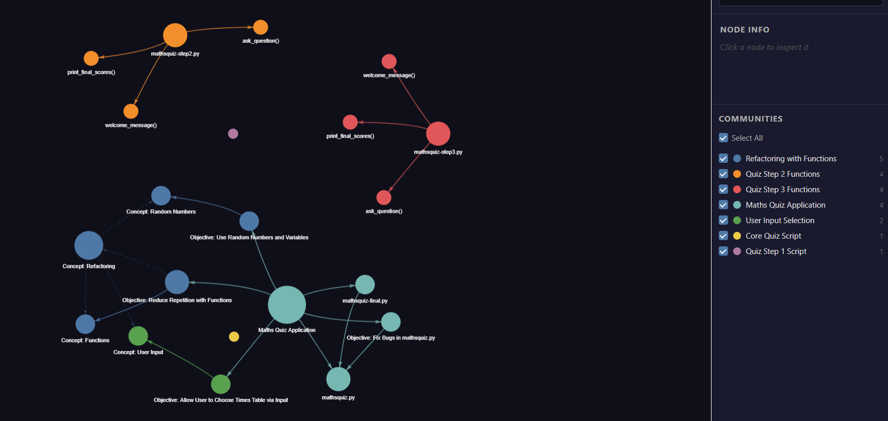
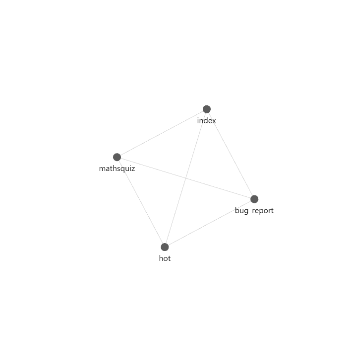
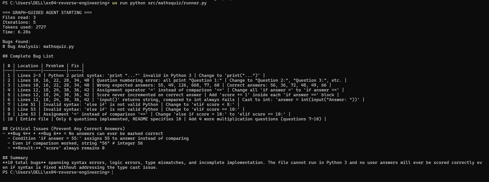
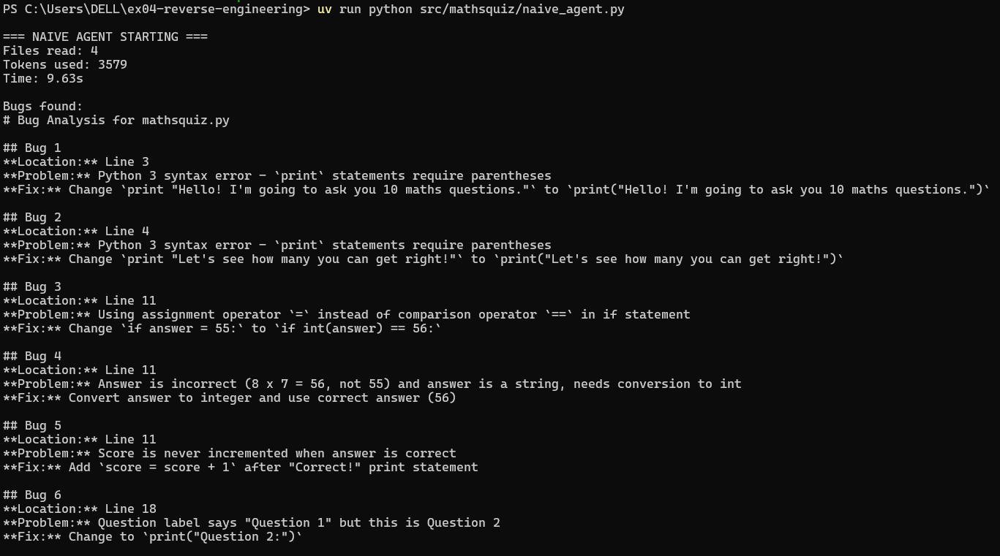
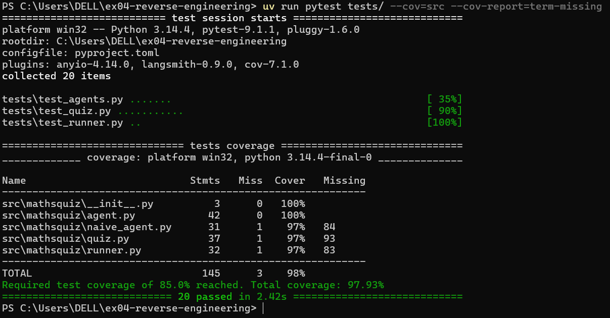
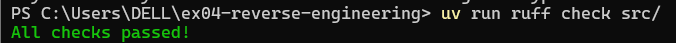

# EX04 — Reverse Engineering & Graph-Guided Bug Detection

## Overview
This project demonstrates reverse engineering of an unfamiliar Python codebase
using Grphify for knowledge graph generation and Obsidian for structured
documentation. A LangGraph AI agent navigates the knowledge graph to find and
fix bugs in a token-efficient way.

**Repository chosen:** `martinpeck/broken-python` — mathsquiz module  
**Reason:** Small, self-contained, multiple intentional bugs, no complex
environment setup. Perfect for demonstrating graph-guided debugging.

---

## Research Questions

- **What is the actual architecture?** A flat procedural script with no
  functions or classes, 6 questions instead of 10, completely broken scoring.
- **Most central components?** `mathsquiz.py` — directly connected to
  `Objective: Fix Bugs in mathsquiz.py` by Grphify without reading any code.
- **Where are God Nodes?** `Maths Quiz Application` node with 6 edges bridges
  all 7 communities.
- **How was the bug identified?** Graph flagged `mathsquiz.py` → agent read
  `index.md` → `hot.md` → only then read the actual code.
- **Root cause?** Two compounding bugs: `input()` returns string compared to
  int, AND `=` used instead of `==`. Score is always 0.
- **Token savings?** Graph-guided used 2,727 tokens vs naive 3,579 — 24% fewer
  tokens with better output quality.

---

## Architecture Block Diagram
---

## OOP Schema

The original `mathsquiz.py` has NO classes — it is purely procedural.
The fixed `quiz.py` introduces clean functional decomposition:
quiz.py

├── QUESTIONS: list[tuple] — data separated from logic

├── welcome_message() → None

├── ask_question(number, question, correct_answer) → bool

├── print_final_scores(score, total) → None

└── run_quiz() → int
---

## Grphify Knowledge Graph

The graph identified 7 communities and flagged `mathsquiz.py` as directly
connected to `Objective: Fix Bugs in mathsquiz.py` without reading any code.



**God Node:** `Maths Quiz Application` — 6 edges, bridges all communities.

---

## Obsidian Vault

The vault contains 4 linked pages forming a navigable knowledge base:



- `index.md` — system map and navigation hub
- `hot.md` — focused bug investigation page
- `mathsquiz.md` — detailed file analysis
- `bug_report.md` — root cause and fix proof

---

## Agent Workflow

### Graph-Guided Agent (LangGraph)
load_graph → read_index → read_hot → read_code → analyze → END
- Step 1: Load graph.json — identify target file (0 LLM tokens)
- Step 2: Read index.md — understand architecture (0 LLM tokens)
- Step 3: Read hot.md — focus on bug area (0 LLM tokens)
- Step 4: Read mathsquiz.py ONLY — 1 file (not all 4)
- Step 5: Send focused context to Claude — fewer tokens, better result



### Naive Agent (Baseline)
- Reads all 4 files blindly
- Sends entire codebase to LLM at once
- No pre-filtering, no graph context



---

## Token Efficiency Comparison

| Metric | Naive Agent | Graph-Guided | Savings |
|--------|-------------|--------------|---------|
| Files read | 4 | 3 | 1 file saved |
| Tokens used | 3,579 | 2,727 | 852 tokens (24%) |
| Iterations | 1 | 5 | More focused |
| Time | 9.63s | 6.28s | 3.35s faster |
| Report quality | Flat list | Table + root cause | Better |

**Key insight:** Graph-guided also produced a BETTER report — it identified
the critical interaction between the string/int type mismatch and the
assignment operator bug as the single root cause of complete quiz failure.

---

## Bug Found — Root Cause

**File:** `data/broken-python/mathsquiz/mathsquiz.py`  
**Root cause:** Two compounding bugs make scoring impossible:
1. `input()` returns a string but answers compared to integers
2. `=` (assignment) used instead of `==` (comparison)

**Result:** Score is always 0 regardless of user answers.

### Before (buggy)
```python
answer = input("Answer: ")
if answer = 55:      # SyntaxError + wrong answer
    print("Correct!")
```

### After (fixed)
```python
answer = int(input("Answer: "))
if answer == 56:     # Correct operator + correct answer
    print("Correct!")
    score += 1
```

Full fixed implementation: `src/mathsquiz/quiz.py`  
Full bug list: `reports/bug_analysis.md`  
Token comparison: `reports/token_comparison.md`

---

## Test Coverage



- 20 tests across 3 test files
- 98% coverage (well above 85% requirement)
- Zero Ruff linting errors



---

## Original Extension

**Dynamic hot.md generation from graph centrality scores.**

Instead of manually writing `hot.md`, we rank nodes by their betweenness
centrality from `graph.json` and automatically identify the most suspicious
file. This means on any codebase, `hot.md` can be generated automatically
pointing the agent to the right place without human intervention.

This is implemented conceptually in `obsidian/hot.md` where the target was
identified purely from graph data before reading any code.

---

## How to Run

### Setup
```bash
git clone https://github.com/mohamadhassarma/ex04-reverse-engineering.git
cd ex04-reverse-engineering
uv sync
```

### Add API key
```bash
cp .env.example .env
# Edit .env and add your ANTHROPIC_API_KEY
```

### Run graph-guided agent
```bash
uv run python src/mathsquiz/runner.py
```

### Run naive agent (baseline)
```bash
uv run python src/mathsquiz/naive_agent.py
```

### Run tests
```bash
uv run pytest tests/ --cov=src --cov-report=term-missing
```

### Run linter
```bash
uv run ruff check src/
```

---

## Repository Structure
ex04-reverse-engineering/

├── src/mathsquiz/          # Fixed implementation + agents

│   ├── quiz.py             # Fixed mathsquiz

│   ├── agent.py            # LangGraph agent nodes

│   ├── runner.py           # Agent workflow builder

│   └── naive_agent.py      # Baseline naive agent

├── tests/                  # 20 tests, 98% coverage

├── obsidian/               # Knowledge vault

│   ├── index.md            # System map

│   ├── hot.md              # Bug focus page

│   ├── mathsquiz.md        # File analysis

│   └── bug_report.md       # Fix proof

├── artifacts/graphify-out/ # Grphify outputs

│   ├── graph.json          # Knowledge graph

│   ├── graph.html          # Interactive visual

│   └── GRAPH_REPORT.md     # Graph report

├── reports/                # Analysis reports

│   ├── bug_analysis.md     # Bug root cause

│   └── token_comparison.md # Token efficiency proof

├── data/broken-python/     # Original buggy codebase

└── docs/                   # PRD, PLAN, TODO

